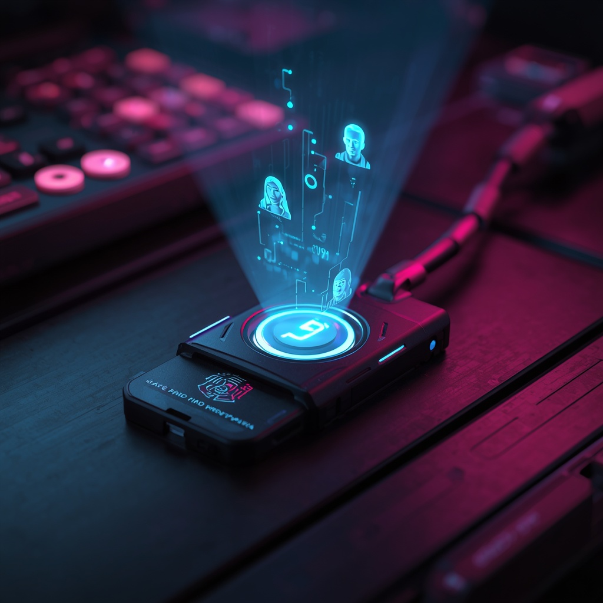

<!-- 3D-STYLE HERO BANNER -->
<div align="center">
  
  
  
</div>
<!-- VISITOR COUNTER -->
<p align="center">
  
</p>

<!-- PROFILE BADGES & SOCIALS -->
<p align="center">
  <a href="mailto:simrafaisal1111@gmail.com">
    
  </a>
  <a href="https://simrafaisal.me">
    
  </a>
  <a href="https://linkedin.com/in/SimraFaisal">
    
  </a>
  <a href="https://github.com/SimraFaisal2">
    
  </a>
</p>


<p align="center">
  
</p>

---

## <div align="center"><code>[ about me ]</code></div>

<p align="center">
  <sub><i>Building systems that see, verify, and decide.</i></sub>
</p>

<h3 align="center">🎓 Applied AI & Computer Science @ Sapienza University of Rome</h3>

<p align="center">
  I build <b>autonomous AI agents</b>, <b>computer vision systems</b>, and <b>biometric authentication models</b> — designed for both performance and rigor.
  <br/>
  <b>BSc, Applied CS & AI (First Class Honours)</b> · <b>AI Research Scholar</b>, Poland
</p>

<p align="center">
  <b>🎯 Mission:</b> Rigorous, well-evaluated models paired with clean, production-ready engineering.
</p>

<p align="center">
  <b>🔍 Focus Areas</b>
  <br/>
  ✨ AI Safety & Autonomous Systems &nbsp;|&nbsp; 🔐 Biometric Authentication &nbsp;|&nbsp; 👁️ Computer Vision
  <br/>
  🤖 Multi-Agent Systems &nbsp;|&nbsp; 📊 Deep Learning Optimization
</p>

<p align="center">
  <b>💼 Open to:</b> Research roles in AI safety, autonomous systems, and biometrics.
</p>

---

## <div align="center"><code>[ tech stack ]</code></div>

<p align="center">
  
</p>

| **Languages** | **AI, ML & Vision** | **Data & Analytics** | **Frameworks & Tools** |
|:---:|:---:|:---:|:---:|
| `Python` `C++` `R` `SQL` | `PyTorch` `TensorFlow` `OpenCV` `MediaPipe` | `Pandas` `NumPy` `Scikit-Learn` | `LangChain` `CrewAI` `LangGraph` |
| `JavaScript` `TypeScript` | `YOLO` `Transformers` `RAG` | `Seaborn` `Tableau` `Looker` | `React` `Node.js` `REST APIs` |

---

## <div align="center"><code>[ featured projects ]</code></div>

### 🔬 Advanced Biometrics & Deep Learning Research

<table align="center">
  <tr>
    <td width="65%">
      <p>
        Conducted research in biometric matching and predictive modeling, building deep learning pipelines for real-world authentication systems — from data preprocessing through deployment-ready evaluation.
      </p>
      <ul>
        <li><b>Stack:</b> Python · PyTorch · TensorFlow · Scikit-Learn · PostgreSQL</li>
        <li><b>Key Achievements:</b>
          <ul>
            <li>✅ Implemented 12+ evaluation metrics (AUC-ROC, FAR/FRR, EER)</li>
            <li>✅ Achieved 96.8% authentication accuracy</li>
            <li>✅ Built privacy-preserving frameworks (differential privacy, adversarial robustness)</li>
            <li>✅ Cut inference latency by 35% via quantization & pruning</li>
          </ul>
        </li>
        <li><b>Location:</b> 📍 Bialystok, Poland (2024–Present)</li>
      </ul>
      <p><code>⚡ AI Research</code> · <code>🔐 Biometrics</code> · <code>✨ Deep Learning</code> · <code>🛡️ Security</code></p>
    </td>
    <td width="35%" align="center">
      
    </td>
  </tr>
</table>

---

### ✋ AI-Powered Hand Gesture Controller

<table align="center">
  <tr>
    <td width="65%">
      <p>
        A real-time computer vision app for contactless system control via hand gestures. Uses OpenCV and Google MediaPipe to track 21 hand landmarks with optimized frame processing for low-latency response.
      </p>
      <ul>
        <li><b>Stack:</b> Python · OpenCV · MediaPipe · NumPy</li>
        <li><b>Performance:</b>
          <ul>
            <li>⚡ &lt;30ms per-frame landmark detection latency</li>
            <li>🎯 8+ recognized gestures (thumbs up/down, peace sign, palm, fist, pinch)</li>
            <li>⚙️ Configurable action mapping for multimedia & system control</li>
          </ul>
        </li>
        <li><b>Features:</b> Real-time feedback · Multi-hand tracking · Gesture smoothing filters</li>
      </ul>
      <p><code>👁️ Computer Vision</code> · <code>⚡ Real-Time</code> · <code>🎮 HCI</code></p>
      <p><a href="https://github.com/SimraFaisal2/gesture-controller"><b>→ View Repository</b></a></p>
    </td>
    <td width="35%" align="center">
      
    </td>
  </tr>
</table>

---

## <div align="center"><code>[ experience & education ]</code></div>

```text
🔬 BIOMETRICS DATA SCIENCE RESEARCH SCHOLAR
   Bialystok, Poland | 2024–Present
   ├─ Trained predictive models (classical ML & deep learning) for biometric matching
   ├─ Built quantitative evaluation pipelines and safety/privacy frameworks
   └─ Research focus: robust authentication, adversarial resilience, responsible AI

🎓 EDUCATION
   ├─ Sapienza University of Rome
   │  BSc, Applied CS & AI — First Class Honours (90%)
   │  Expected Graduation: 2025
   └─ Alpha College
      A-Levels: 5A* — Class Valedictorian & 100% Merit Scholar (2022)

📜 CERTIFICATIONS
   ├─ DeepLearning.AI — Machine Learning & Deep Learning Specialization (Andrew Ng)
   ├─ DataCamp — Professional Python Data Associate
   └─ Google — Professional Data Analytics Certificate

🌐 LANGUAGES
   └─ English (Fluent) · Urdu (Fluent) · Italian (Intermediate)
```

---

## <div align="center"><code>[ recent activity ]</code></div>

<p align="center">
  
</p>

---

## <div align="center"><code>[ github stats ]</code></div>

<p align="center">
  
  
</p>

<p align="center">
  
</p>

<p align="center">
  
</p>
<!-- Fallback if this also fails: raw.githubusercontent.com/SimraFaisal2/SimraFaisal2/output/trophy.svg
     (self-hosted version generated by snake.yml — check the Actions log for the
     "Generate trophy SVG" step if that one isn't producing a file) -->

<!-- CONTRIBUTION SNAKE -->
<p align="center">
  
</p>

---

<div align="center">

### <code>[ let's build something ]</code>

Always open to a conversation about AI safety, biometrics, or a hard research problem.

<a href="mailto:simrafaisal1111@gmail.com"></a>
<a href="https://simrafaisal.me"></a>
<a href="https://linkedin.com/in/SimraFaisal"></a>

<sub>Thanks for stopping by — if any of this was useful, a ⭐ on one of the repos above goes a long way.</sub>

</div>

<!-- FOOTER WAVE -->
<p align="center">
  
</p>
