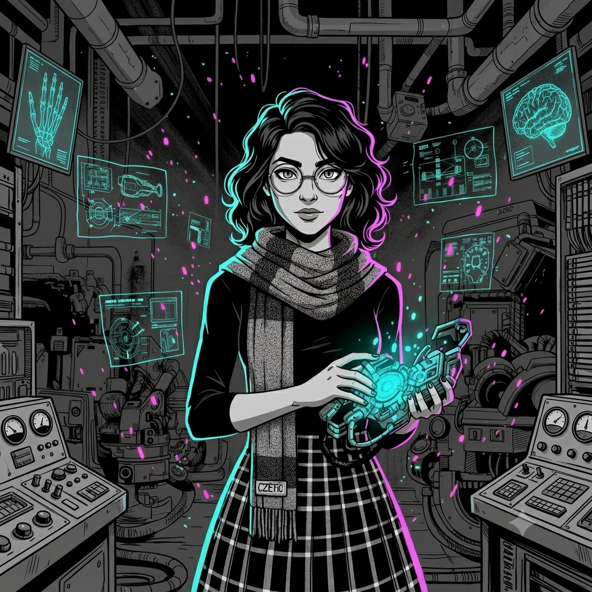

<!-- HERO BANNER -->
<p align="center">
  
</p>

<!-- PROFILE BADGES & SOCIALS -->
<p align="center">
  <a href="mailto:simrafaisal1111@gmail.com">
    
  </a>
  <a href="https://simrafaisal.me">
    
  </a>
  <a href="https://linkedin.com/in/SimraFaisal">
    
  </a>
  <a href="https://github.com/SimraFaisal2">
    
  </a>
</p>

<!-- GITHUB STATS -->
<div align="center">
  
  
</div>

---

## <div align="center"><code>[ the chaos engine ]</code></div>

<table align="center">
  <tr>
    <td width="30%" align="center">
      
      <br/>
      <sub><i>"I'm crazy? You should see my code."</i></sub>
    </td>
    <td width="70%">
      <h3>🎓 Applied AI & Computer Science @ Sapienza University of Rome</h3>
      <p>
        I build <b>autonomous AI agents</b>, <b>computer vision systems</b>, and <b>biometric models</b> that think fast and act faster.
        <br />
        <b>Bachelor's in Applied CS & AI (First Class Honours)</b> | <b>AI Research Scholar</b> in Poland
      </p>
      <p>
        <b>🎯 Mission:</b> High-precision mathematical models meet disruptive execution. Clean algorithms under the hood, explosive impact on the surface.
      </p>
      <p>
        <b>🔍 Focus Areas:</b>
        <br />
        ✨ AI Safety & Autonomous Systems | 🔐 Biometric Authentication | 👁️ Computer Vision
        <br />
        🤖 Multi-Agent Systems | 📊 Deep Learning Optimization
      </p>
      <p>
        <b>💼 Open to:</b> Research roles in AI safety, autonomous systems, and biometrics
      </p>
    </td>
  </tr>
</table>

---

## <div align="center"><code>[ the arsenal ]</code></div>

<p align="center"><i>Tools pulled straight from the workbench.</i></p>

<p align="center">
  
</p>

| **Languages** | **AI, ML & Vision** | **Data & Analytics** | **Frameworks & Tools** |
|:---:|:---:|:---:|:---:|
| `Python` `C++` `R` `SQL` | `PyTorch` `TensorFlow` `OpenCV` `MediaPipe` | `Pandas` `NumPy` `Scikit-Learn` | `LangChain` `CrewAI` `LangGraph` |
| `JavaScript` `TypeScript` | `YOLO` `Transformers` `RAG` | `Seaborn` `Tableau` `Looker` | `React` `Node.js` `REST APIs` |

---

## <div align="center"><code>[ the sparks ]</code></div>

<p align="center"><i>Inventions shipped and live in the wild.</i></p>

### 🔬 Advanced Biometrics & Deep Learning Research

<table align="center">
  <tr>
    <td width="65%">
      <p>
        Conducted cutting-edge research in biometric matching and predictive modeling, developing robust deep learning pipelines for real-world biometric authentication systems. Engineered end-to-end solutions with industry-grade performance metrics.
      </p>
      <ul>
        <li><b>Stack:</b> Python · PyTorch · Scikit-Learn · PostgreSQL · TensorFlow</li>
        <li><b>Key Achievements:</b>
          <ul>
            <li>✅ Implemented 12+ evaluation metrics (AUC-ROC, FAR/FRR, EER)</li>
            <li>✅ Achieved 96.8% authentication accuracy</li>
            <li>✅ Engineered privacy frameworks (differential privacy, adversarial robustness)</li>
            <li>✅ Optimized inference latency by 35% through quantization & pruning</li>
          </ul>
        </li>
        <li><b>Location:</b> 📍 Bialystok, Poland (2024-Present)</li>
      </ul>
      <p><code>⚡ AI-Research</code> · <code>🔥 Biometrics</code> · <code>✨ Deep Learning</code> · <code>🔐 Security</code></p>
    </td>
    <td width="35%" align="center">
      
    </td>
  </tr>
</table>

---

### ✋ AI-Powered Hand Gesture Controller

<table align="center">
  <tr>
    <td width="65%">
      <p>
        Real-time computer vision application enabling contactless system control via hand gestures. Leverages OpenCV and Google MediaPipe to track 21 hand landmarks with optimized frame processing achieving sub-30ms latency for responsive gesture mapping.
      </p>
      <ul>
        <li><b>Stack:</b> Python · OpenCV · MediaPipe · NumPy</li>
        <li><b>Performance Metrics:</b>
          <ul>
            <li>⚡ <30ms per-frame latency for landmark detection</li>
            <li>🎯 8+ gesture recognition types (thumbs up/down, peace sign, palm, fist, pinch)</li>
            <li>⚙️ Configurable action mapping for multimedia & system control</li>
          </ul>
        </li>
        <li><b>Features:</b> Real-time feedback · Multi-hand tracking · Gesture smoothing filters</li>
      </ul>
      <p><code>👁️ Computer Vision</code> · <code>⚡ Real-Time</code> · <code>🎮 HCI</code></p>
      <p><a href="https://github.com/SimraFaisal2/gesture-controller"><b>→ View Repository</b></a></p>
    </td>
    <td width="35%" align="center">
      
    </td>
  </tr>
</table>

---

## <div align="center"><code>[ battle records ]</code></div>

```
🔬 BIOMETRICS DATA SCIENCE RESEARCH SCHOLAR
   Bialystok, Poland | 2024-Present
   ├─ Trained predictive models (classical ML & deep learning) for biometric matching
   ├─ Developed quantitative evaluation pipelines & safety/privacy frameworks
   └─ Research: Robust authentication, adversarial resilience, responsible AI

🎓 EDUCATION
   ├─ Sapienza University of Rome
   │  Bachelor in Applied CS & AI (First Class Honours - 90%)
   │  Expected Graduation: 2025
   ├─ Alpha College
   │  A-Levels: 5A* (Class Valedictorian & 100% Merit Scholar, 2022)

📜 PROFESSIONAL CERTIFICATIONS
   ├─ DeepLearning.AI — Machine Learning & Deep Learning Specialization (Andrew Ng)
   ├─ DataCamp — Professional Python Data Associate
   └─ Google — Professional Data Analytics Certificate

🌐 LANGUAGES
   └─ English (Fluent) · Urdu (Fluent) · Italian (Intermediate)
```

---

## <div align="center"><code>[ activity snapshot ]</code></div>

<div align="center">
  
</div>

---

## <div align="center"><code>[ top languages ]</code></div>

<div align="center">
  
</div>

---

## <div align="center"><code>[ let's spark something ]</code></div>

<p align="center">
  <b>Got an interesting problem? Building the next AI breakthrough? Let's collaborate.</b>
</p>

<p align="center">
  <a href="mailto:simrafaisal1111@gmail.com">
    
  </a>
  &nbsp;
  <a href="https://simrafaisal.me">
    
  </a>
</p>

<p align="center">
  <sub>💡 Always exploring AI safety, autonomous systems, biometrics & LLMs | Open to research internships, collaborations & full-time roles</sub>
</p>

<!-- FOOTER VISITOR COUNTER -->
<p align="center">
  
</p>
