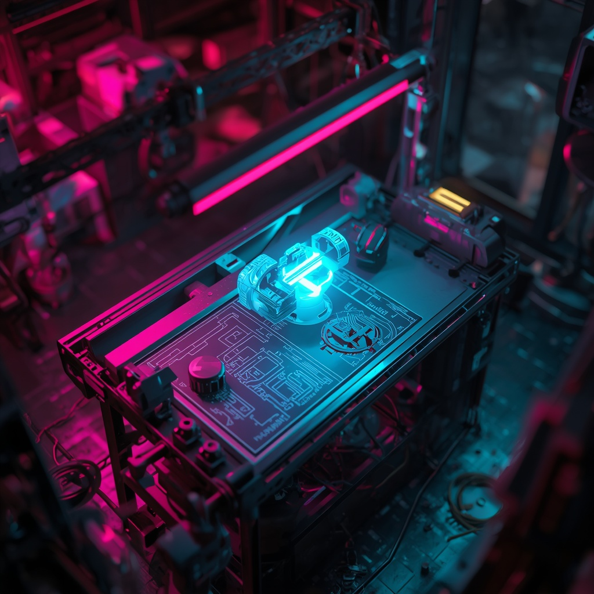
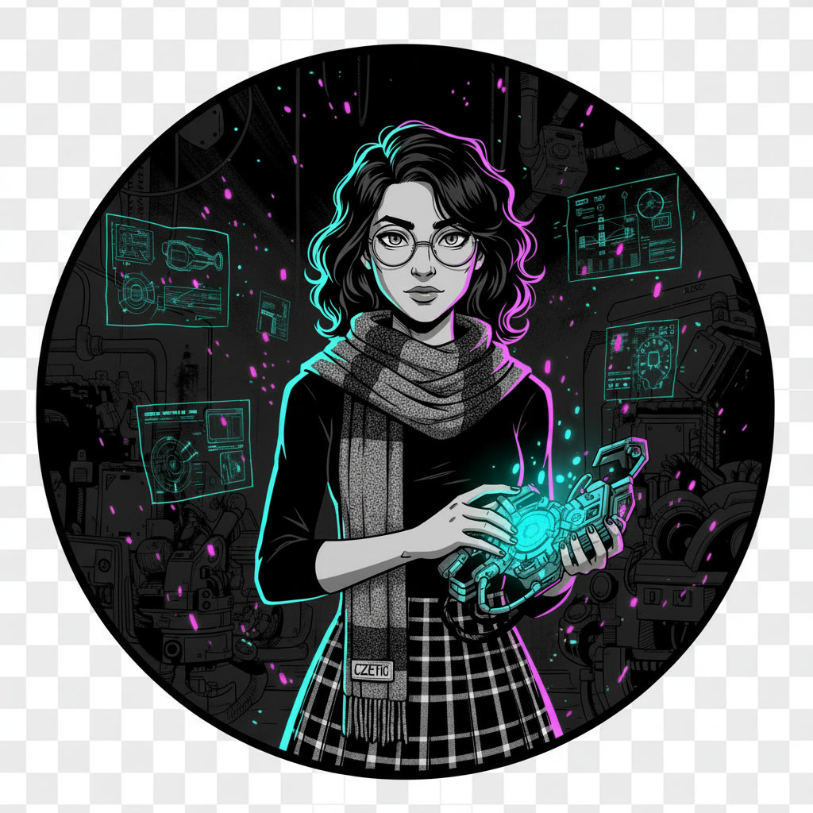

<!-- HERO BANNER -->
<p align="center">
  <!-- Reduced width and added a dimensional border -->
  
</p>

<!-- NEON BADGES & LINKS -->
<p align="center">
  <a href="mailto:simrafaisal1111@gmail.com"></a>
  <a href="https://simrafaisal.me"></a>
  <a href="https://linkedin.com/in/SimraFaisal"></a>
  <a href="https://github.com/SimraFaisal2"></a>
</p>

---

<!-- QUICK NAVIGATION -->
<p align="center">
  <strong>
    <a href="#about--philosophy">About</a> •
    <a href="#the-arsenal">Skills</a> •
    <a href="#featured-projects">Projects</a> •
    <a href="#research--certifications">Research</a> •
    <a href="#lets-collaborate">Collaborate</a>
  </strong>
</p>

---

<!-- SECTION 1: ABOUT & PHILOSOPHY -->
<h2 align="center" id="about--philosophy"><code>[ the chaos engine ]</code></h2>

<table align="center">
  <tr>
    <td width="30%" align="center">
      <!-- Changed to .png for transparency support -->
      <br/>
      <sub><i>"I'm crazy? You should see my code."</i></sub>
    </td>
    <td width="70%">
      <h3>Applied AI & Computer Science @ Sapienza University of Rome 🇮🇹</h3>
      <p>
        I build autonomous AI agents, computer vision systems, and biometrics models that think fast and act faster. 
        Currently pursuing a Bachelor's in Applied CS & AI with First Class Honours at Sapienza University of Rome, 
        and conducting AI research in Poland.
      </p>
      <p>
        <b>Engineering Philosophy:</b> High-precision mathematical models meet disruptive execution. Clean algorithms under the hood, explosive impact on the surface.
      </p>
      <p>
        <code>Cyan</code> for cold logic. <code>Magenta</code> for raw innovation. 
        Together, they spark the system.
      </p>
      <p>
        <b>Currently:</b> Developing autonomous AI agents | <b>Open to:</b> Research roles in AI safety & biometrics
      </p>
    </td>
  </tr>
</table>

---

<!-- SECTION 2: TECH STACK -->
<h2 align="center" id="the-arsenal"><code>[ the arsenal ]</code></h2>

<p align="center"><i>Tools pulled straight from the workbench.</i></p>

<p align="center">
  
</p>

<!-- Centered HTML Table -->
<table align="center">
  <thead>
    <tr>
      <th>Languages</th>
      <th>AI, ML & Vision</th>
      <th>Data & Analytics</th>
      <th>Frameworks & Tools</th>
    </tr>
  </thead>
  <tbody>
    <tr>
      <td><code>Python</code> <code>C++</code></td>
      <td><code>PyTorch</code> <code>OpenCV</code></td>
      <td><code>Pandas</code> <code>NumPy</code></td>
      <td><code>LangChain</code> <code>CrewAI</code></td>
    </tr>
    <tr>
      <td><code>R</code> <code>SQL</code></td>
      <td><code>MediaPipe</code> <code>Scikit-Learn</code></td>
      <td><code>Seaborn</code> <code>Tableau</code></td>
      <td><code>React</code> <code>Tailwind</code></td>
    </tr>
    <tr>
      <td><code>JavaScript</code> <code>TypeScript</code></td>
      <td><code>LangGraph</code> <code>RAG</code></td>
      <td><code>SQL</code> <code>Looker</code></td>
      <td><code>Node.js</code> <code>REST APIs</code></td>
    </tr>
  </tbody>
</table>

---

<!-- SECTION 3: FEATURED PROJECTS -->
<h2 align="center" id="featured-projects"><code>[ the sparks ]</code></h2>

<p align="center"><i>Inventions shipped and live in the wild.</i></p>

<table align="center">
  <tr>
    <td width="65%">
      <h3>🔬 AI Research Internship Project</h3>
      <p>
        Advanced biometric matching and predictive modeling research focused on developing robust deep learning pipelines for real-world biometric authentication systems. Built comprehensive evaluation frameworks incorporating privacy-preserving techniques and safety protocols for responsible AI deployment.
      </p>
      <ul>
        <li><b>Stack:</b> Python · PyTorch · Scikit-Learn · PostgreSQL</li>
        <li><b>Impact:</b> Developed quantitative evaluation pipelines; implemented privacy & safety frameworks for production AI systems</li>
        <li><b>Location:</b> Bialystok, Poland</li>
      </ul>
      <p><code>⚡ AI-Research</code> · <code>🔥 Biometrics</code> · <code>✨ Deep Learning</code></p>
    </td>
    <td width="35%" align="center">
      
    </td>
  </tr>
  <tr>
    <td width="65%">
      <h3>✋ AI-Powered Hand Gesture Controller</h3>
      <p>
        A real-time computer vision application enabling contactless system operations. 
        Utilizes OpenCV and Google MediaPipe to track 21 distinct hand landmarks with 
        optimized frame processing pipelines for ultra-low latency gesture mapping.
      </p>
      <ul>
        <li><b>Stack:</b> Python · OpenCV · MediaPipe</li>
        <li><b>Capabilities:</b> <30ms latency landmark tracking & gesture-to-action execution</li>
        <li><b>Features:</b> Multi-gesture recognition, configurable action mapping, real-time feedback</li>
      </ul>
      <p><code>👁️ Computer Vision</code> · <code>⚡ Real-Time</code> · <code>🎮 HCI</code></p>
      <p><a href="https://github.com/SimraFaisal2">→ View on GitHub</a></p>
    </td>
    <td width="35%" align="center">
      <!-- Last image height reduced to match instructions -->
      
    </td>
  </tr>
</table>

---

<!-- SECTION 4: RESEARCH & CERTIFICATIONS -->
<h2 align="center" id="research--certifications"><code>[ battle records ]</code></h2>

```text
🔬 Biometrics Data Science Research Scholar — Bialystok, Poland
   └─ Trained predictive models across classical ML & deep learning for biometric matching
   └─ Developed quantitative evaluation pipelines & safety/privacy frameworks for AI deployment
   └─ Research focus: Robust authentication systems & responsible AI

📜 Professional Certifications
   ├─ DeepLearning.AI — Machine Learning & Deep Learning Specialization (Andrew Ng)
   ├─ DataCamp — Professional Python Data Associate
   └─ Google — Professional Data Analytics Certificate

🎓 Academic Merit
   ├─ Sapienza University of Rome — Bachelor in Applied CS & AI (First Class Honours - 90%)
   └─ Alpha College — A-Levels 5A* (Class Valedictorian & 100% Merit Scholar)
```

---

<!-- SECTION 5: CALL TO ACTION -->
<h2 align="center" id="lets-collaborate"><code>[ let's spark something ]</code></h2>

<p align="center">
  <b>Got an interesting problem? Let's collaborate.</b>
</p>

<p align="center">
  <a href="mailto:simrafaisal1111@gmail.com"></a>
  &nbsp;
  <a href="https://simrafaisal.me"></a>
</p>

<p align="center">
  <sub>💡 Always exploring AI safety, biometrics, and autonomous systems | Open to research internships & collaboration</sub>
</p>
